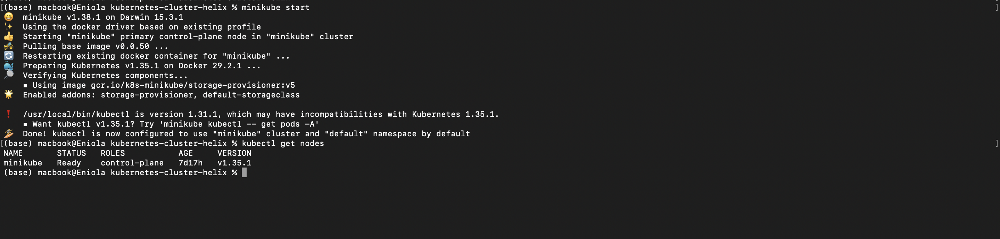
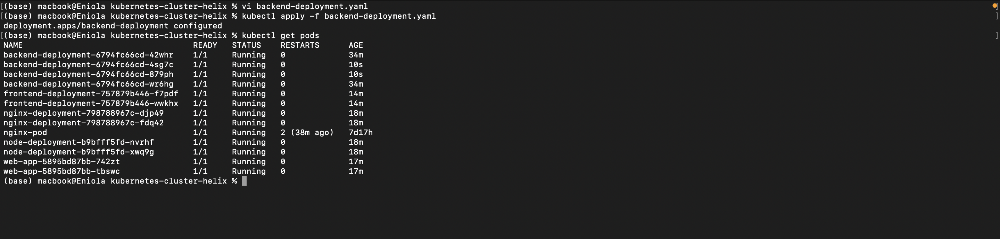
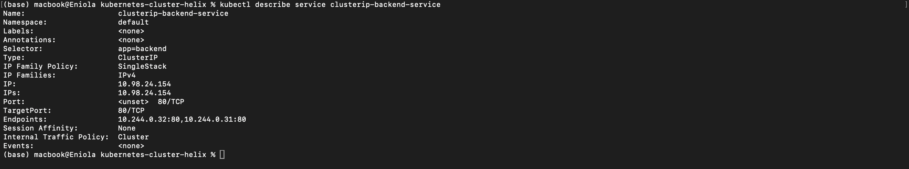
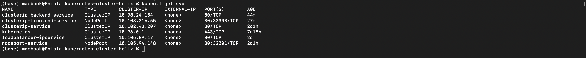
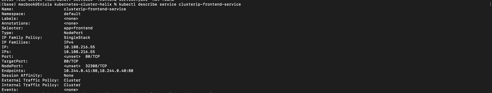
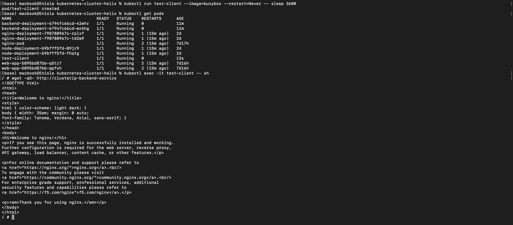
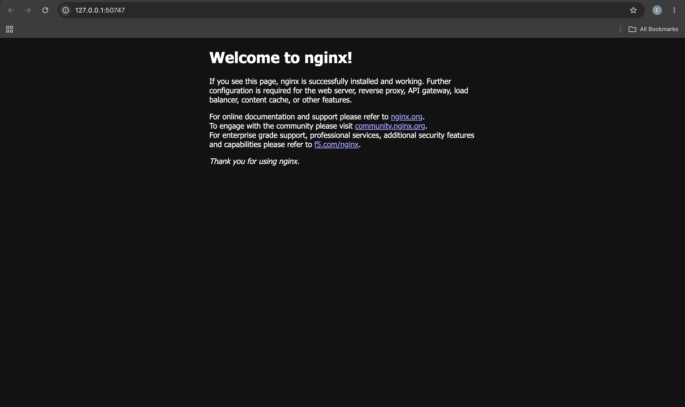
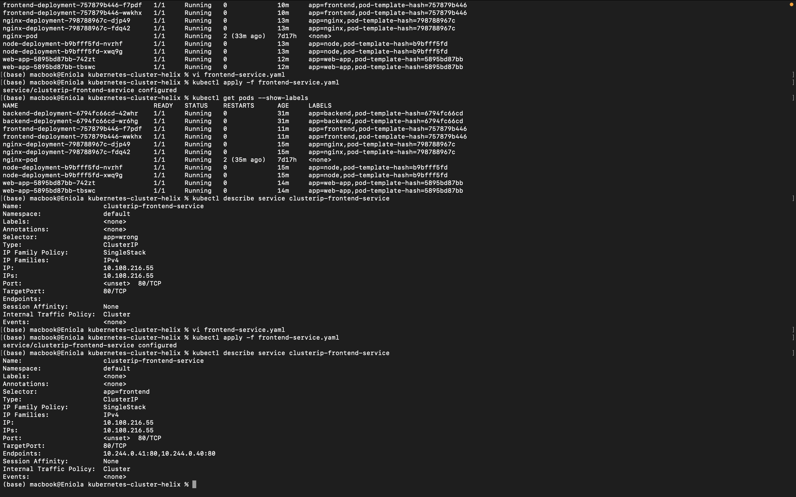

# Kubernetes Services with Minikube

## Project Overview

This project demonstrates the use of Kubernetes Services to expose and provide network access to applications running inside a Minikube Kubernetes cluster.

The project covers:

* Creating and managing Kubernetes Deployments
* Creating ClusterIP and NodePort Services
* Using Service selectors to route traffic to Pods
* Inspecting Service endpoints
* Testing internal and external Service connectivity
* Scaling Deployments
* Observing how Services continue routing traffic as Pods change

## Technologies Used

* Kubernetes
* Minikube
* kubectl
* Nginx
* macOS

## Project Structure

```text
kubernetes-cluster-helix/
│
├── README.md
│
├── backend-deployment.yaml
├── backend-service.yaml
├── frontend-deployment.yaml
└── frontend-service.yaml
```

## 1. Minikube Cluster Setup

The Kubernetes cluster was started using Minikube and verified to ensure that the cluster node was available and ready.

```bash
minikube start
minikube status
kubectl get nodes
```

The Minikube node was successfully started and was in the `Ready` state.



---

## 2. Deployments

Two application Deployments were created:

* `backend-deployment`
* `frontend-deployment`

The backend Deployment was configured with an initial replica count of 2 and was later scaled to 4 replicas.

The frontend Deployment was configured with 2 replicas.

### Backend Deployment

```text
Deployment: backend-deployment
Replicas: 4
Container: nginx
Label: app=backend
```

### Frontend Deployment

```text
Deployment: frontend-deployment
Replicas: 2
Container: nginx
Label: app=frontend
```

The running Pods were verified using:

```bash
kubectl get pods
```



---

## 3. Backend ClusterIP Service

A ClusterIP Service named `clusterip-backend-service` was created to provide internal access to the backend Pods.

### Service Details

| Property   | Value                       |
| ---------- | --------------------------- |
| Name       | `clusterip-backend-service` |
| Type       | `ClusterIP`                 |
| ClusterIP  | `10.98.24.154`              |
| Port       | `80/TCP`                    |
| TargetPort | `80/TCP`                    |
| Selector   | `app=backend`               |
| Endpoints  | 4                           |

The Service was inspected using:

```bash
kubectl describe service clusterip-backend-service
```

The Service correctly identified the backend Pods through the `app=backend` selector.



---

## 4. Frontend NodePort Service

A NodePort Service named `clusterip-frontend-service` was used to expose the frontend application outside the Kubernetes cluster.

Although the Service name contains `clusterip`, its actual Service type is `NodePort`.

### Service Details

| Property     | Value                        |
| ------------ | ---------------------------- |
| Name         | `clusterip-frontend-service` |
| Type         | `NodePort`                   |
| ClusterIP    | `10.108.216.55`              |
| Service Port | `80/TCP`                     |
| NodePort     | `32308`                      |
| TargetPort   | `80/TCP`                     |
| Selector     | `app=frontend`               |
| Endpoints    | 2                            |

The Service was verified using:

```bash
kubectl get svc
kubectl describe service clusterip-frontend-service
```




---

## 5. Testing the Backend Service

The backend Service was tested from inside the Kubernetes cluster using a temporary client Pod.

The ClusterIP Service provides internal network access to the backend Pods without exposing the Service externally.

The Service successfully routed requests to the backend Pods selected by:

```text
app=backend
```



---

## 6. Testing the Frontend NodePort Service

The frontend was exposed using a NodePort Service.

The Service was accessed through Minikube using:

```bash
minikube service clusterip-frontend-service
```

The Service successfully exposed the Nginx frontend application.



The screenshot shows the Nginx default page being served successfully through the Kubernetes Service.

---

## 7. Service Selectors

Kubernetes Services use selectors to determine which Pods should receive traffic.

The backend Service uses:

```yaml
selector:
  app: backend
```

The frontend Service uses:

```yaml
selector:
  app: frontend
```

The Pods were labelled accordingly:

```text
Backend Pods:
app=backend

Frontend Pods:
app=frontend
```

This allows Kubernetes to automatically associate the Services with the appropriate Pods.

---

## 8. Selector Experiment

A Service selector was intentionally modified to demonstrate what happens when a Service selector does not match any existing Pod labels.

When the selector did not match the expected Pods, the Service had no valid endpoints to route traffic to.

The issue was identified by inspecting the Service and its endpoints.



The original selector was then restored so that the Service could correctly identify the intended Pods.

---

## 9. Scaling the Backend Deployment

The backend Deployment was initially configured with 2 replicas and was later scaled to 4 replicas.

The Deployment was scaled using:

```bash
kubectl scale deployment backend-deployment --replicas=4
```

The resulting Pods were verified using:

```bash
kubectl get pods
```

The backend Service automatically included the additional Pods as endpoints because they matched the Service selector:

```text
app=backend
```

---

## 10. Pod Failure and Service Resilience

One of the backend Pods was deleted to observe Kubernetes self-healing behaviour.

Kubernetes automatically created a replacement Pod because the Deployment was configured to maintain the desired number of replicas.

The Service continued to route traffic to available backend Pods through its selector.

This demonstrates the relationship between Deployments, Pods, and Services:

```text
Deployment
    |
    | manages
    v
  Pods
    |
    | selected by
    v
 Service
    |
    | routes traffic
    v
Application
```

---

## 11. Questions and Answers

### 1. What is a Service in Kubernetes?

A Service is a Kubernetes resource that provides a stable network endpoint for accessing a group of Pods. It allows applications to communicate with Pods without depending on individual Pod IP addresses.

### 2. Why can't you reliably use a Pod IP address?

Pod IP addresses are not permanent. Pods can be deleted and recreated, especially when they are managed by Deployments, causing their IP addresses to change.

### 3. What problem does a Service solve?

A Service provides a stable endpoint and automatically routes traffic to the appropriate Pods selected by its selector.

### 4. What is the difference between ClusterIP and NodePort?

A ClusterIP Service provides internal access within the Kubernetes cluster, while a NodePort Service exposes the Service through a port on the Kubernetes node, allowing access from outside the cluster.

### 5. Why does a Service need a selector?

A selector tells Kubernetes which Pods belong to the Service. The Service uses the matching Pods as its endpoints for routing traffic.

### 6. What happens if no Pods match the selector?

The Service has no endpoints and therefore has no matching Pods to which it can route traffic.

### 7. Why is Kubernetes networking dynamic?

Kubernetes is designed to manage workloads whose Pods can be created, deleted, replaced, and scaled dynamically. Services provide stable networking while automatically updating their endpoints as matching Pods change.

### 8. How does scaling a Deployment affect the Service?

When a Deployment is scaled, the number of Pods changes. As long as the new Pods have labels matching the Service selector, Kubernetes automatically adds them to the Service's endpoints.

---

## 12. Lessons Learned

1. **Services provide stable networking for dynamic Pods.** Pod IP addresses can change, so applications should communicate through Services instead of relying directly on Pod IPs.

2. **Selectors are fundamental to Service discovery.** A Service can only route traffic to Pods whose labels match its selector.

3. **ClusterIP and NodePort serve different purposes.** ClusterIP is suitable for internal cluster communication, while NodePort provides external access through a node port.

4. **Services automatically update their endpoints.** When matching Pods are created, deleted, or replaced, Kubernetes updates the Service endpoints accordingly.

5. **Deployments and Services work together.** Deployments manage the desired number of Pods, while Services provide stable access to those Pods.

6. **Scaling does not require manually updating the Service.** New Pods that match the Service selector are automatically added as endpoints.

7. **Kubernetes supports self-healing.** When a Pod managed by a Deployment fails or is deleted, the Deployment creates a replacement to maintain the desired replica count.

---

## Conclusion

This project demonstrated how Kubernetes Services provide stable and dynamic networking for applications running in a Minikube cluster.

The project used a ClusterIP Service for the backend and a NodePort Service for the frontend. Deployments were used to manage the application Pods, while Service selectors were used to dynamically identify the Pods that should receive traffic.

The scaling and Pod failure experiments demonstrated how Kubernetes maintains the desired state of an application while Services continue to provide stable access to the available Pods.

